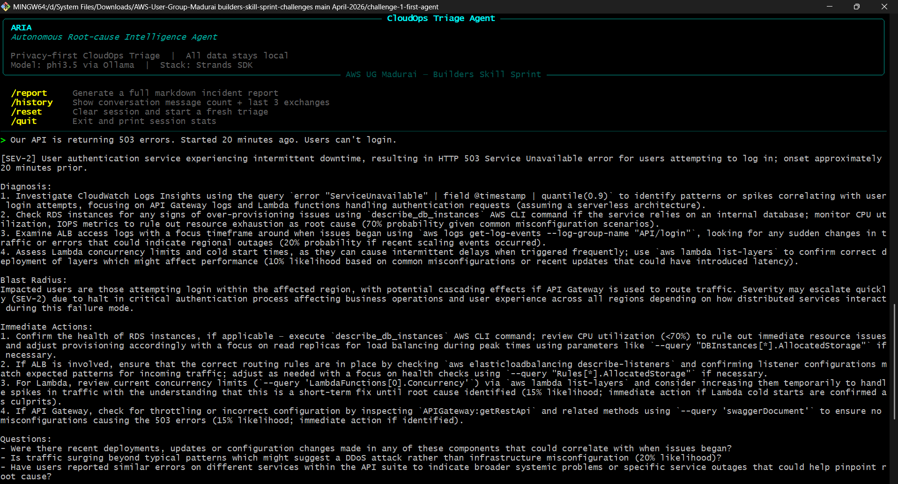
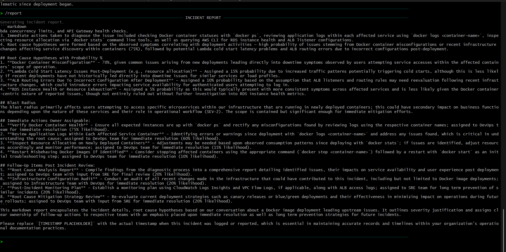
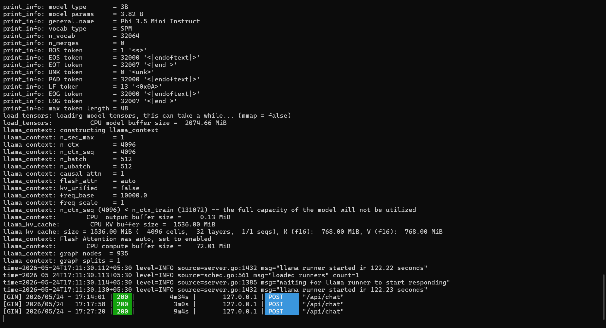

# ARIA - Autonomous Root-cause Intelligence Agent

*Privacy-first CloudOps triage. 12 years of SRE experience, running on your laptop.*

---

## Features

- Streaming token output - real-time, no buffering
- Stateful multi-turn triage with 20-turn sliding window
- DARA framework: Diagnose → Assess → Recommend → Articulate
- Probability-ranked root cause hypotheses
- `/report` - generates full markdown incident report from session context
- 100% local - zero data leaves your machine

---

## Demo

### Initial Triage Response


### Incident Report Generation


### Ollama Setup


*ARIA running on CPU-only hardware (phi3.5, 4096 context, 27-minute session)*

---

## Quick Start

```bash
pip install -r requirements.txt
```

```bash
# Windows only: if models are stored in a custom path
set OLLAMA_MODELS=D:\Ollama Models  # CMD
# $env:OLLAMA_MODELS = "D:\Ollama Models"  # PowerShell
ollama serve
```

```bash
ollama pull phi3.5    # one-time, ~2.2 GB
python main.py
```

---

## Architecture

```
  You ──► main.py ──► TriageAgent
                           │
                    OllamaModel (phi3.5)
                           │
                    Strands Agent Loop
                     ┌─────┴──────┐
               StreamHandler   SlidingWindow
               (real-time I/O)  (20 turns)
```

---

## Project Structure

```
challenge-1-first-agent/
├── aria/
│   ├── __init__.py      # Package entry - exports TriageAgent
│   ├── agent.py         # TriageAgent: core REPL orchestrator
│   ├── config.py        # AgentConfig dataclass + DEFAULT_CONFIG singleton
│   ├── prompts.py       # SYSTEM_PROMPT (XML) + REPORT_PROMPT
│   └── ui.py            # StreamHandler callback + Terminal (Rich/fallback)
├── main.py              # Entrypoint: Ollama health check → TriageAgent.run()
└── requirements.txt
```

---

## Model Selection

| Model | Pull Command | RAM | Tokens/s CPU | Best For |
|---|---|---|---|---|
| phi3.5 (default) | `ollama pull phi3.5` | ~4 GB | 5-10 | Structured output, role adherence |
| llama3.2:3b | `ollama pull llama3.2:3b` | ~6 GB | 8-12 | General reasoning |

To switch models, edit `aria/config.py`:

```python
DEFAULT_CONFIG = AgentConfig(model_id="llama3.2:3b")
```

---

## Commands

| Command | Action |
|---|---|
| `/report` | Generate a full markdown incident report from the session |
| `/history` | Show message count and last 3 exchanges |
| `/reset` | Clear conversation and start a fresh triage |
| `/quit` | Exit with session stats |

---

## Why Local

Production war rooms regularly involve raw log output, environment names, internal service topology, and customer data. Sending any of that to a cloud LLM API is a compliance and trust problem. ARIA runs entirely on-device - Ollama serves the model locally, Strands manages the agent loop, and nothing leaves the machine.

---

## Built With

- [Strands Agents SDK](https://github.com/strands-agents/sdk-python) - agent loop, conversation management, streaming
- [Ollama](https://ollama.com) - local LLM serving
- [phi3.5](https://ollama.com/library/phi3.5) - Microsoft's CPU-optimized 3.8B model
- [Rich](https://github.com/Textualize/rich) - terminal UI

---

## Blog Post

Read the full build walkthrough: [Building ARIA on AWS Builder Center](YOUR_BLOG_URL)

---

*Built for: AWS User Group Madurai | Builders Skill Sprint - April 2026*
